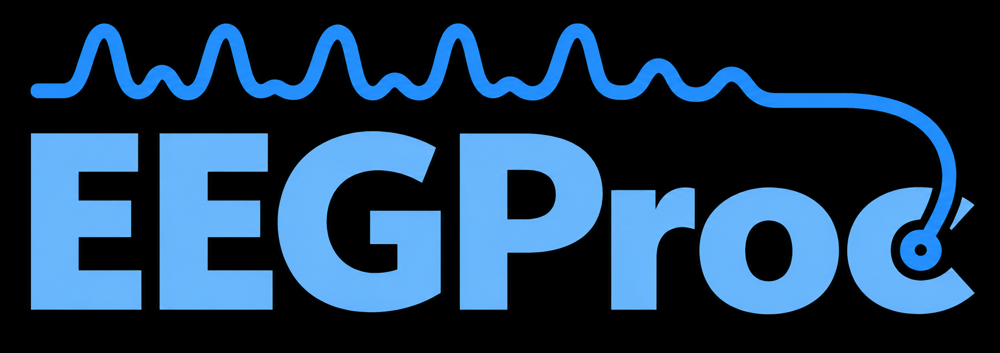
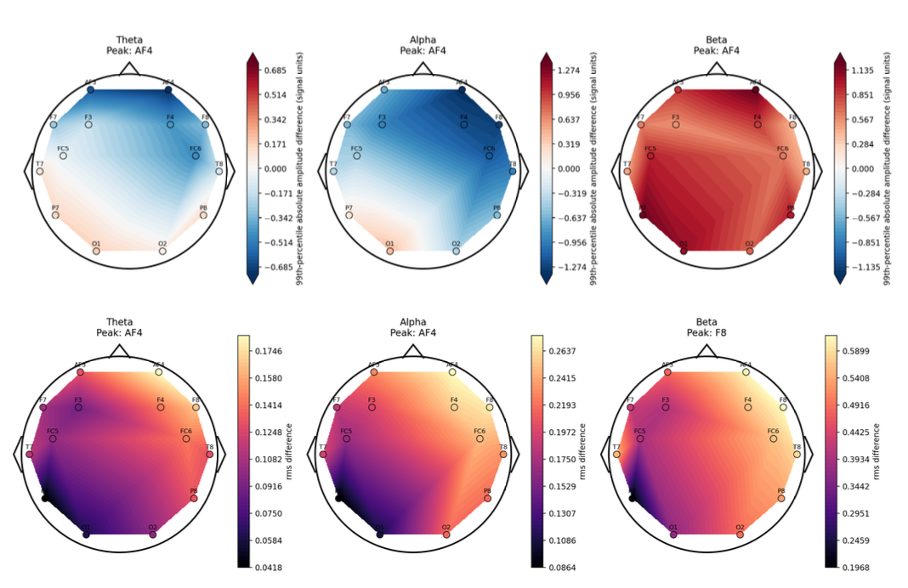

<p align="center">
  
</p>

<p align="center">
  <strong>Thank you to all our contributors:</strong>
  <a href="https://github.com/VitorInserra">@VitorInserra</a>
  · <a href="https://github.com/Pranav1006">@Pranav1006</a>
  · <a href="https://github.com/sainag7">@sainag7</a>
  · <a href="https://github.com/qwertyuiopzxcvbnmlkjhgfdsa">@qwertyuiopzxcvbnmlkjhgfdsa</a>
  · <a href="https://github.com/ygadipalli">@ygadipalli</a>
</p>

# EEGProc

A lightweight Python library for EEG preprocessing, feature extraction, deep
learning, and model explanations.

Built by researchers at **Columbia University** and the **University of North
Carolina (UNC)**, EEGProc has been used in research published at international
conferences. It helps researchers and developers prepare EEG data, evaluate
models, and explore their predictions with reusable, well-documented components.

## Install

```bash
pip install eegproc                   # preprocessing, features, conversion, plotting
pip install "eegproc[deep-learning]"  # adds models, cross-validation, counterfactuals
```

Requires Python 3.10 or newer. TensorFlow is optional and is installed with the
`deep-learning` extra.

## Start with the DREAMER example

The [commented example script](examples/dreamer_bilstm_counterfactual.py) walks
through preprocessing, PSD feature extraction, a BiLSTM classifier,
leave-one-subject-out cross-validation (LOSOCV), and a model-agnostic
counterfactual for a held-out input.

Follow the [example README](examples/README.md) for installation, dataset
conversion, run commands, and an explanation of every step and output.

## What EEGProc provides

- **Preprocessing and features:** filtering, detrending, spectral band powers,
  Hjorth parameters, and Shannon, wavelet, and IMF entropy.
- **Dataset conversion:** convert downloaded DREAMER, AMIGOS, EEGEmotions-27,
  and DEAP recordings into tidy CSV tables.
- **Models and evaluation:** reusable CNN/GNN components, RNN classifiers,
  classifier heads, losses, and subject-wise cross-validation.
- **Model explanations:** adapter-based counterfactual optimization for
  differentiable models, with plots and scalp topographies.

See the [getting-started guide](docs/source/getting-started.md) for focused API
examples. The [dataset guide](docs/source/datasets.md) covers supported layouts
and download links; recordings are not bundled.

## Featurization

```python
import pandas as pd
from eegproc import bandpass_filter, psd_bandpowers, shannons_entropy, FREQUENCY_BANDS

raw = pd.read_csv("my_eeg.csv")        # one column per electrode
fs = 128

clean = bandpass_filter(raw, fs, bands=FREQUENCY_BANDS)   # -> AF3_alpha, AF3_theta, ...
psd = psd_bandpowers(clean, fs, bands=FREQUENCY_BANDS)    # one row per window
entropy = shannons_entropy(psd)                           # -> AF3_entropy, F7_entropy
```

Featurizers compose in a pipeline: the band-energy functions consume a filtered
signal, and the entropy functions consume the corresponding energy table.

| Function | Consumes | Emits |
|---|---|---|
| `bandpass_filter` | raw signal | `{channel}_{band}` |
| `psd_bandpowers` | filtered signal | `{channel}_{band}` |
| `shannons_entropy` | PSD table | `{channel}_entropy` |
| `hjorth_params` | filtered signal | `{channel}_{band}_activity`, `_mobility`, `_complexity` |
| `wavelet_band_energy` | raw signal | `{channel}_{band}_wenergy` |
| `wavelet_entropy` | wavelet energy | `{channel}_wentropy` |
| `imf_band_energy` | raw signal | `{channel}_{band}_imfenergy` |
| `imf_entropy` | IMF energy | `{channel}_imfentropy` |

## Explain predictions with scalp topographies

EEGProc's model-agnostic module can visualize the differences between an input
and its counterfactual across electrodes and frequency bands. Scalp topographies
help show where those changes are concentrated.



*Example theta, alpha, and beta topographies: amplitude differences in the top
row and root-mean-square (RMS) differences in the bottom row.*

See the [model-agnostic counterfactual guide](src/eegproc/model_explainability/model_agnostic/README.md#topographies)
for plotting commands and the channel positions, band metadata, and normalization
information needed to interpret your own results.

## Cross-validation

Start with a feature CSV containing `subject`, `trial`, a binary `label` (0 or 1),
and your feature columns. Keep feature rows in time order within each trial.
This example uses two alpha-band features and four rows per sequence; change
`feature_columns` to match your table. The complete [DREAMER example](examples/README.md)
shows how to prepare this kind of table from recordings.

```python
import pandas as pd
from eegproc.deep_learning.cross_validation import cross_validate_dataframe
from eegproc.deep_learning.supervised.rnn_architectures import BiLSTMClassifier

features = pd.read_csv("features.csv")

def build_model(training_features):
    # EEGProc supplies only this fold's training inputs; build a fresh model.
    _, timesteps, n_features = training_features.shape
    return BiLSTMClassifier(
        timesteps, n_features, n_classes=2, lstm_units=16, n_bilstm_layers=1,
    ).build()

results = cross_validate_dataframe(
    features, build_model, strategy="fixed_loso", fs=128,
    feature_columns=("AF3_alpha", "F7_alpha"),  # Exclude ratings and metadata.
    window_rows=4, normalize="subject_zscore",
    fixed_config={}, n_epochs=10, batch_size=32,
)
print(pd.DataFrame(results["user_metrics"])[["subject_id", "accuracy"]])
```

`fixed_loso` trains on all other subjects and evaluates each held-out subject once,
using the same settings in every fold. Windows stay within trials, and results
use your original subject identifiers. `subject_zscore` uses each subject's own
unlabeled data, including the held-out subject's data; omit it when that offline
normalization assumption does not fit your evaluation.

Other strategies include `loso`, `subject_calibration` (few-shot adaptation),
and `nested_lnso` (nested leave-N-subjects-out). For converted recordings, always
select the EEG features explicitly; the [dataset guide](docs/source/datasets.md#use-the-result)
shows how to keep ratings, ECG, and metadata out of model inputs.

## Package layout

| Module | Purpose |
| --- | --- |
| [`eegproc.preprocessing`](src/eegproc/preprocessing.py) | Filtering, detrending, and band decomposition |
| [`eegproc.featurization`](src/eegproc/featurization.py) | Spectral, Hjorth, wavelet, and IMF features |
| [`eegproc.data`](src/eegproc/data/) | Dataset conversion, table schema, and trial-safe windowing |
| [`eegproc.deep_learning`](src/eegproc/deep_learning/README.md) | Reusable models, cross-validation, and domain generalization |
| [`eegproc.model_explainability`](src/eegproc/model_explainability/model_agnostic/README.md) | Model-agnostic counterfactuals and topographies |
| [`eegproc.plotting`](src/eegproc/plotting/) | EEG feature plots |

## Documentation and contributing

Browse the [documentation](https://eego-unc.github.io/EEGProc/), follow the
[contribution guide](CONTRIBUTING.md), or read the [changelog](CHANGELOG.md).
If you use EEGProc in your research, see [CITATION.cff](CITATION.cff).

## License

GPLv2. See [LICENSE](LICENSE).
