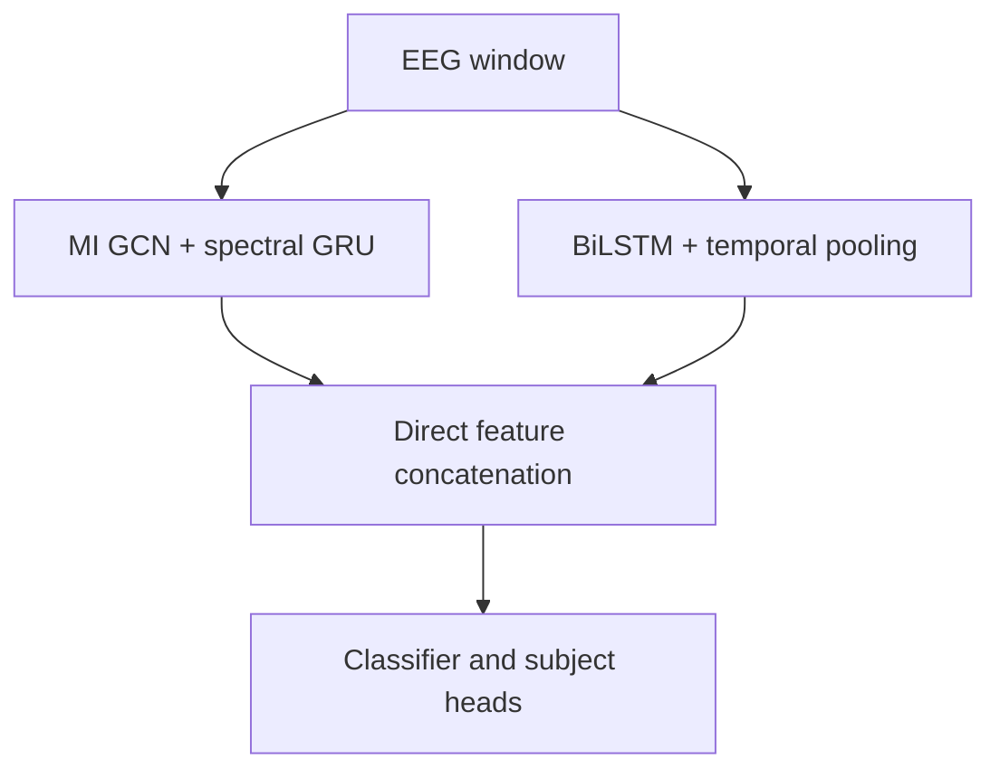

# Subject Invariant Calibrator (SIC)

SIC is an EEG emotion-classification pipeline for measuring cross-subject generalization and rapid user calibration on DREAMER. Each outer fold trains a population model without one target subject, evaluates that subject at zero shot, saves the untouched LOSO model, and then measures how performance changes after fine-tuning the classifier with a small number of the target subject's trials.

The current SIC encoder is deterministic. It does not contain an encoder VAE, a learned \(z\) projection, reparameterized sampling, KL loss on the encoder outputs, a reconstruction loss, or a decoder.

## Experiment goals

The supplied experiments answer four main questions:

1. How well does the population model predict a completely unseen subject?
2. How do 3-, 6-, 9-, and 12-shot calibration affect discrimination and probability calibration?
3. How do ERM, V-REx, and first-order MLDG compare?
4. How much do the GCN-GRU branch, the BiLSTM branch, and median-rating trials contribute?

The pipeline reports accuracy, balanced accuracy, F1, precision, recall, their macro variants, ROC-AUC, Brier score, and expected calibration error (ECE). The supplied runs use Brier score as the configuration-selection and prediction-diagnostic metric because lower Brier score means better probability predictions.

## Deterministic architecture

For every EEG window, SIC runs the GCN-GRU and BiLSTM encoders independently.



### GCN-GRU branch

The graph branch constructs a mutual-information adjacency matrix from source-training data only. The held-out LOSO subject is never used to estimate this graph.

Band-separated graph convolutions extract spatial/spectral relationships and a spectral GRU combines the band representations. Its output width is

$$
d_g=\texttt{spectral\_gru\_units}.
$$

The supplied scripts use \(d_g=384\).

### BiLSTM branch

The BiLSTM receives the original channel-band sequence independently of the graph branch. Its forward and backward outputs are concatenated, so

$$
d_b=2\,\texttt{bilstm\_units}.
$$

Average pooling aligns only the BiLSTM time axis with the downsampled GCN-GRU time axis. It does not reduce the feature dimension.

### Direct concatenation

After temporal alignment, the complete branch vectors are concatenated along the feature axis:

$$
h_{\text{joint},t}=[h_{\text{GCN-GRU},t};h_{\text{BiLSTM},t}],
\qquad
d_{\text{joint}}=d_g+d_b.
$$

There is no Dense layer, posterior head, or learned fusion network between the encoders and this concatenation. Global average pooling then removes the time axis before the final heads:

$$
\bar h_{\text{joint}}=\frac{1}{T}\sum_{t=1}^{T}h_{\text{joint},t}.
$$

Pooling reduces the temporal axis, not the feature axis. The classifier and subject-adversarial heads perform the learned fusion.

| Configuration | GCN-GRU width | BiLSTM width | Concatenated width |
| --- | ---: | ---: | ---: |
| Model defaults (`bilstm_units=128`) | 384 | 256 | 640 |
| Smoke/full candidate (`bilstm_units=63`) | 384 | 126 | 510 |
| Full-grid candidates (`42`, `63`, `96`) | 384 | 84/126/192 | 468/510/576 |
| `no_bilstm` | 384 | — | 384 |
| `no_gcn_gru`, 63 units | — | 126 | 126 |

At least one encoder branch must remain active.

### Classifier and subject adversary

The pooled feature vector enters the dense feature blocks specified by `classification_hidden_units`, followed by one `VariationalClassifier` logits head. The subject head receives the same pooled encoder vector through gradient reversal.

The `VariationalClassifier` is the sole emotion-classification head. There is no parallel dense focal head: its one logits tensor is used for prediction, focal loss, and the joint VC objective. This is distinct from variational autoencoding:

- it operates inside the final classifier objective;
- its learned class parameters update during source training and subject calibration;
- it does not replace or reduce the GCN-GRU or BiLSTM outputs;
- it does not create the encoder's fused representation; and
- it does not reconstruct EEG.

The primary supervised classifier term is focal loss:

$$
L_{\text{focal}}
=
-\alpha_t(1-p_t)^\gamma\log p_t.
$$

The ordinary source objective is approximately

$$
L_{\text{source}}
=
w_{\text{VC}}L_{\text{focal+VC}}
+
w_{\text{subject}}L_{\text{subject}}
+
L_{\text{regularization}}.
$$

There is no encoder-VAE or reconstruction term in this objective.

## Source-training methods

Select the source method with `--training-method` or the scripts' `TRAINING_METHOD` environment variable.

### ERM

ERM minimizes the pooled source objective using ordinary batches:

```bash
TRAINING_METHOD=erm ./submit_sic_direct_concat_v10_suite.sh full 2
```

### V-REx

V-REx treats source subjects as environments. If \(R_s\) is the focal risk for subject \(s\), it adds

$$
L_{\text{V-REx}}
=
L_{\text{source}}
+
\lambda_{\text{V-REx}}\operatorname{Var}(R_1,\ldots,R_S).
$$

Use `VREX_PENALTY_WEIGHT` to set the penalty weight:

```bash
TRAINING_METHOD=vrex VREX_PENALTY_WEIGHT=1.0 \
  ./submit_sic_direct_concat_v10_suite.sh full 2
```

### First-order MLDG

MLDG forms complete-trial episodes with disjoint subject groups:

- A: meta-train subjects;
- B: rotating virtual-unseen meta-test subjects.

For each episode:

1. Compute the complete source objective on A.
2. Take a temporary inner step with `mldg_inner_learning_rate`.
3. Evaluate focal emotion classification on B at the temporary parameters.
4. Restore the original parameters.
5. Apply one persistent optimizer update using the A gradient plus `mldg_meta_test_weight` times the B gradient.

The temporary inner update is detached, so the implementation is first-order MLDG and does not compute Hessians.

The MLDG implementation is separated into `MetaLearning.py`. That module owns the complete-trial episode sequence, MLDG fit adapter, temporary inner update, gradient combination, and gradient-cosine diagnostic. `sic_model.py` delegates its MLDG update to that module.

The supplied scripts use 18 A subjects, 4 B subjects, and one complete trial per selected subject. This requires all 22 non-target DREAMER subjects to remain in the source-training pool.

## Strict LOSO and zero-shot model saving

For every hyperparameter configuration and target subject:

1. Exclude all data from the target subject.
2. Build the MI graph from source-training features only.
3. Train a fresh source model on the remaining subjects.
4. Evaluate the untouched model on all target trials.
5. Save that exact zero-shot source model as a native `.keras` file.
6. Restore the same source weights independently for every calibration continuation.

Saved models are written inside each configuration directory:

```text
configuration_####/
└── loso_zero_shot_models/
    └── loso_fold_####_target_<subject>_zero_shot.keras
```

`loso_zero_shot_models.json` records the model paths and load metadata. Load a saved model with `compile=False` before installing a new optimizer for later calibration.

Only the zero-shot LOSO models are saved. Calibrated subject-specific continuations are intentionally not saved because calibration is quick and each fold is reproducible from the source model.

## Target-subject calibration

A calibration shot is one complete target-subject trial, not one window. For every requested `(SHOTS, FOLDS)` pair:

1. Build a seeded target-only calibration/evaluation split.
2. Restore the untouched LOSO source weights.
3. Evaluate zero shot on the fold's evaluation trials.
4. Freeze the encoder and subject-invariance components while keeping the VC classification head trainable.
5. Unfreeze the requested dense suffix before the VC head.
6. Fine-tune on the calibration trials using a fresh optimizer.
7. Re-evaluate the same held-out evaluation trials.
8. Report paired zero-shot, calibrated, and calibrated-minus-zero-shot metrics.

`calibration_unfreeze_layers=2` selects the final classifier hidden block plus the VC logits head. `calibration_use_vc_target=false` disables only the auxiliary VC regularizers during calibration; it does not freeze or replace the VC head. Every calibration fold begins from the same zero-shot model.

The full script evaluates:

| Shots | Folds |
| ---: | ---: |
| 3 | 6 |
| 6 | 3 |
| 9 | 2 |
| 12 | 3 |

The full run selects configurations using 12-shot calibrated Brier score. Change `--hyperparameter-selection-level` to `losocv` to rank by zero-shot LOSO while still running and reporting calibration.

## Prediction diagnostics

Enable source-training diagnostics with:

```bash
--prediction-diagnostics \
--prediction-diagnostics-metric brier_score \
--prediction-diagnostics-every-n-epochs 1 \
--prediction-diagnostics-max-samples 256
```

`--prediction-diagnostics-metric` accepts:

- `accuracy`
- `f1`, `precision`, `recall`
- `macro_f1`, `macro_precision`, `macro_recall`
- `balanced_accuracy`
- `roc_auc`
- `brier_score`
- `ece`

Each diagnostic row stores both `reported_metric` and `reported_metric_value`, along with confidence and class-fraction summaries. Rows are saved to `sic_prediction_diagnostics.csv` and retained in the complete JSON results.

The callback evaluates a fixed approximately class-balanced subset. With the supplied MLDG scripts, `--validation-subjects 0` means diagnostics contain the source-training split only. The target LOSO subject is never used for per-epoch diagnostics.

The worker scripts expose three shell overrides:

```bash
PREDICTION_DIAGNOSTICS_METRIC=ece \
PREDICTION_DIAGNOSTICS_EVERY_N_EPOCHS=5 \
PREDICTION_DIAGNOSTICS_MAX_SAMPLES=512 \
  ./submit_sic_direct_concat_v10_suite.sh full 2
```

SIC predictions are deterministic. The scripts therefore do not request latent Monte Carlo samples or variational uncertainty intervals.

## Code organization

| File | Responsibility |
| --- | --- |
| `sic_model.py` | Deterministic GCN-GRU/BiLSTM architecture, ERM and V-REx steps, classifier/subject heads, calibration freezing, prediction |
| `MetaLearning.py` | SIC MLDG episode sampling, fit adaptation, temporary inner update, first-order gradient combination |
| `sic_model_train.py` | Data loading, grid execution, experiment orchestration, artifact writing |
| `sic_model_args.py` | All CLI flags, JSON decoding, Cartesian-grid expansion, validation, and `SICTrainingConfig` |
| `cross_val.py` | Strict LOSO evaluation, calibration folds, metrics, aggregation, zero-shot model saving |
| `training_outputs.py` | Prediction diagnostics and compact epoch reporting |
| `smoke_test_sic_direct_concat_v10.sh` | Two-task structural smoke array |
| `full_run_sic_direct_concat_v10.sh` | Four-task full ablation array |
| `submit_sic_direct_concat_v10_suite.sh` | Submission, dependency, and array-throttle launcher |

The training entry point contains no `argparse` definitions. New experiment flags belong in `sic_model_args.py`.

A representative project layout is:

```text
EEGProc/
├── requirements.txt
├── datasets/remove_gamma/
│   ├── dreamer_eeg.npy
│   └── dreamer_labels.npy
├── smoke_test_sic_direct_concat_v10.sh
├── full_run_sic_direct_concat_v10.sh
├── submit_sic_direct_concat_v10_suite.sh
└── src/eegproc/deep_learning/
    ├── cross_val.py
    ├── training_outputs.py
    ├── generalize_optimization_strats/
    │   └── MetaLearning.py
    ├── supervised/
    │   └── variational_classifier.py
    ├── unsupervised/GNN/
    │   └── GCNMTL.py
    └── joint_architectures/SICModel/
        ├── sic_model.py
        ├── sic_model_train.py
        └── sic_model_args.py
```

The scripts default to `$HOME/EEGProc` and `$HOME/EEGProc/venv312`. Override `PROJECT_DIR`, `VENV_DIR`, `EEG_PATH`, or `LABELS_PATH` when necessary.

## Running on Slurm

Make the launcher executable once:

```bash
chmod +x submit_sic_direct_concat_v10_suite.sh
```

### Smoke test

```bash
./submit_sic_direct_concat_v10_suite.sh smoke 2
```

or submit the worker directly:

```bash
sbatch smoke_test_sic_direct_concat_v10.sh
```

The smoke array runs:

| Task | Profile |
| ---: | --- |
| 0 | `full` |
| 1 | `no_bilstm` |

Defaults are two target subjects, three source epochs, three calibration epochs, and two MLDG episodes per epoch.

```bash
MAX_SUBJECTS=4 SOURCE_EPOCHS=10 CALIBRATION_EPOCHS=10 \
MLDG_STEPS_PER_EPOCH=10 ./submit_sic_direct_concat_v10_suite.sh smoke 2
```

### Full ablation

```bash
./submit_sic_direct_concat_v10_suite.sh full 2
```

or:

```bash
sbatch full_run_sic_direct_concat_v10.sh
```

The four array tasks are:

| Task | Profile | Change from full |
| ---: | --- | --- |
| 0 | `full` | Both deterministic branches; retain rating-3 trials |
| 1 | `remove_median` | Remove complete trials whose raw target rating is 3 |
| 2 | `no_gcn_gru` | Use only the BiLSTM branch |
| 3 | `no_bilstm` | Use only the GCN-GRU branch |

There is no `no_decoder` profile because current SIC has no decoder in any profile.

The full header uses `#SBATCH --array=0-3%2`: four jobs are created, with at most two active simultaneously. Each active task requests two GPUs.

### Smoke-gated full run

```bash
./submit_sic_direct_concat_v10_suite.sh full-after-smoke 2
```

Slurm holds the full array until all smoke tasks finish successfully.

### Valence and arousal

Valence is the default. To run arousal:

```bash
TARGET_DIMENSION=arousal ./submit_sic_direct_concat_v10_suite.sh full-after-smoke 2
```

The target dimension is included in the output path and run name.

### Resubmitting one profile

```bash
sbatch --array=2 full_run_sic_direct_concat_v10.sh
```

Task 2 is the `no_gcn_gru` profile.

## Hyperparameter grid size

The full script searches:

- `bilstm_units`: 42, 63, 96 when the BiLSTM is active;
- `focal_gamma`: 0, 1, 2; and
- `vc_beta`: 0.5, 1.5, 2.5.

This produces:

| Profile | Candidates |
| --- | ---: |
| `full` | 27 |
| `remove_median` | 27 |
| `no_gcn_gru` | 27 |
| `no_bilstm` | 9 |
| Total per target dimension and training method | 90 |

Every candidate performs the configured target-subject LOSO folds and calibration levels. Run the smoke suite before launching the complete grid.

## Output reports

The run root contains the resolved training configuration, submitted grid, progress state, ranked results, and best hyperparameters. Each `configuration_####/` directory contains:

- `model_config.json`
- `dataset_ablation.json`
- `sic_calibration_results.json`
- `sic_overall_metrics.json`
- `sic_subject_summary.csv`
- `sic_calibration_folds.csv`
- `sic_prediction_diagnostics.csv` when diagnostics are enabled
- `sic_window_predictions.csv`
- `sic_trial_predictions.csv`
- `loso_zero_shot_models.json`
- `loso_zero_shot_models/*.keras`

Important aggregate groups include:

- `zero_shot_all_trials_mean_scores`
- `zero_shot_all_trials_std_scores`
- `calibration_levels.<shots>.paired_zero_shot_mean_scores`
- `calibration_levels.<shots>.calibrated_mean_scores`
- `calibration_levels.<shots>.delta_mean_scores`

Brier score is minimized. Most discrimination metrics are maximized.

## Early stopping and MLDG subject counts

The supplied MLDG scripts use:

```text
validation_subjects = 0
A subjects = 18
B subjects = 4
```

This consumes all 22 non-target DREAMER source subjects in every MLDG episode. Early stopping is disabled and all source epochs run.

If source-validation subjects are introduced, reduce `mldg_meta_train_subjects` and/or `mldg_meta_test_subjects` so their sum does not exceed the remaining gradient-training subjects. For example, four source-validation subjects leave 18 gradient-training subjects, so A=14 and B=4 is valid.

## Removed settings

Do not place these obsolete encoder-VAE settings in the JSON configuration:

- `use_decoder`
- `z_log_var_clip_min`
- `z_log_var_clip_max`
- `vae_loss_weight`
- `vae_beta`
- `decoder_dropout`

Deterministic SIC always uses active parallel branches and direct feature concatenation.

The current model does not implement a supervised-contrastive-loss option. Do not add `use_supcon` or `supcon_*` keys unless that feature is implemented in the model first.
